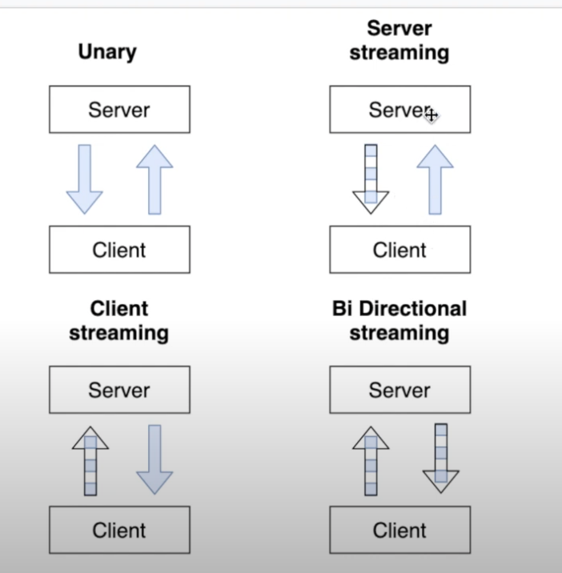

### 4 types

```html
1. unary
2. server streaming
3. client streaming
4. bi directionl streaming
```



### the most important concepts

1. protocol buffers:
	- define messages and services by the server application.
		The gRPC services send and receive data as Protocol Buffer Messages
2. server
	- the server application implements and defines RPC services
3. client
	- the client application use the RPC services defined by server
