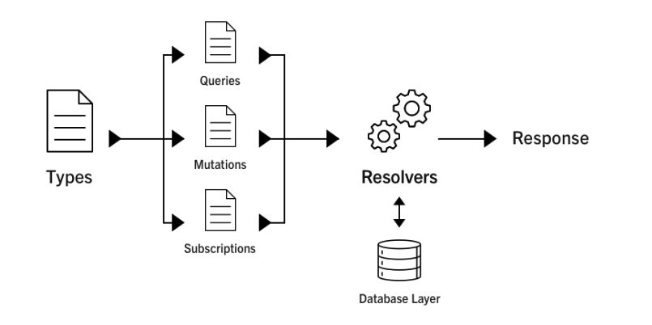

Here's a quick chart to show you the GraphQL analogs of typical REST-ish terms:

| Requirement                  | REST             | GraphQL    |
| ---------------------------- | -----------------|------------|
| Fetching data                | GET              |query       |
| Writing data                 | POST             |mutation    |
| Updating/deleting data       | PUT/PATCH/DELETE |mutation    |
| Watching/subscribing to data | -                |subscription|

### Cau truc GraphQL chia thanh 3 phan chinh:

1. Query (lấy dữ liệu)
2. Mutation (làm gì đó thay đổi với dữ liệu)
3. Subscription

