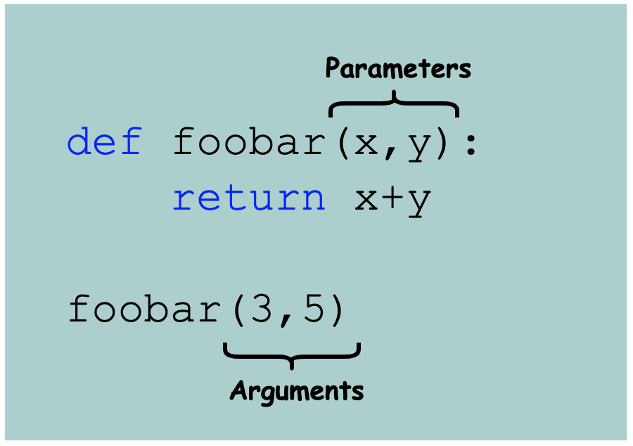

- A parameter is a variable in a function definition. It is a placeholder and hence does not have a concrete value.
- An argument is a value passed during function invocation.

[source](https://www.educative.io/answers/parameter-vs-argument)
