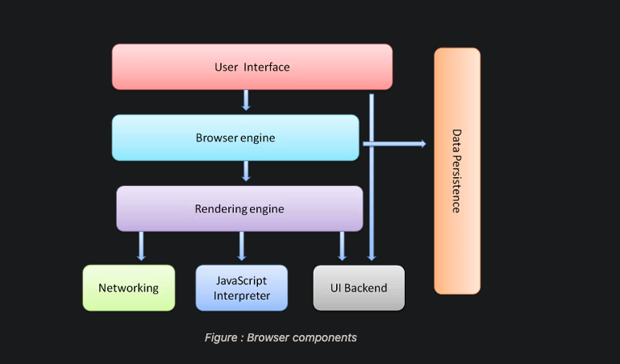

```html
Primary components of a browser are

1. User Interface
	– This consists of forward and back button, bookmarks, address bar etc.
	along with the window that displays the requested page.
2. Browser engine
	– It commands action between rendering engine and the user interface.
3. Rendering engine
	– The main function of rendering engine is to display the content that is requested.
	For example, if an HTML content is requested, the engine parses CSS and HTML and
	when the content is parsed, it is displayed on the screen.
4. User Interface backend
	– It can be used for painting basic images like windows or combo box.
	The backend exposes only a generic platform independent interface.
	Beneath it, user interface methods are used by the operating system.
5. JS Interpreter
	– JavaScript and all other types of scripting is parsed and executed by the inbuilt interpreter.
6. Networking
	– Performs implements of HTTP request and response.
7. Data Storage
	– All types of data, like cookies are saved locally by the browser.
	Storage mechanisms like WebSQL, FileSystem, localStorage are also supported by the browser.
```



```html
1. Navigation
	- first step in loading webpage

	1.a. DNS lookup
	1.b. TCP Handshake
	1.c. TLS Negotiation

2. Response
	2.a. TCP Slow Start / 14kb rule
	2.b. Congestion control

3. Parsing
	3.a. Building the DOM tree
  3.b. Preload scanner

4. Building the CSSOM
	4.a. Other Processes
  - JavaScript Compilation
  - Building the Accessibility Tree

5. Render
	5.a. Style
	5.b. Layout
	5.c. Paint
	5.d. Compositing

6. Interactivity
```

[source](https://developer.mozilla.org/en-US/docs/Web/Performance/How_browsers_work)
[source](https://web.dev/howbrowserswork/#Resources)
[source](https://www.lambdatest.com/blog/how-browsers-work-a-peek-under-the-hood/)
