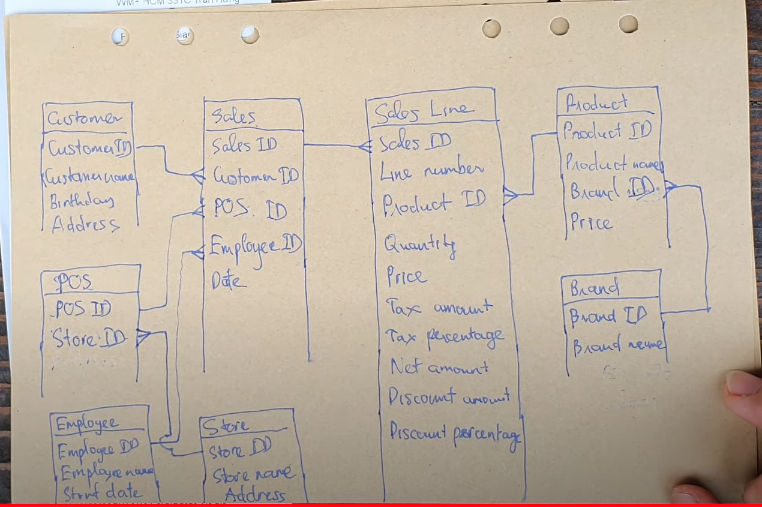

### self learning about data modeling
- điều đầu tiên trước khi modeling là từ yêu cầu thực tế

#### practice: thiết kế dữ liệu bán hàng (dựa trên bill của TH truemilk)
1. chap1

sales
===================================
|product|quantity|price|datetime  |
|sữa hạt|4       |12250|2020-04-11|

2. chap2

sales
===================================
|product|quantity|price|datetime  |
|sữa hạt|4       |12250|2020-04-11|

- data model này thì không thể biết khách hàng nào mua đơn hàng trên
=> update lại data model

sales
================================================
|product|quantity|price|datetime  |customer|tax|
|sữa hạt|4       |12250|2020-04-11|				 |   |

3. chap3 (primay key)

sales
=======================================================
sale_id|product|quantity|price|datetime  |customer|tax|
PT_001 |sữa hạt|4       |12250|2020-04-11|				|   |

4. chap4

sales
=========================================================
sale_id|product |quantity|price|datetime  |customer |tax|
PT_001 |sữa hạt |4       |12250|2020-04-11|Duc		  |   |
PT_002 |sữa chua|5       |10250|2020-04-11|Duc		  |   |

- làm sao xác định customer là một hay hai người khác nhau => thêm customer_id

sales
========================================================================
sale_id|product |quantity|price|datetime  |customer_id|customer name|tax|
PT_001 |sữa hạt |4       |12250|2020-04-11|1          |Duc		  		|   |
PT_002 |sữa chua|5       |10250|2020-04-11|2          |Duc		  		|   |

- case: nếu customer Duc muốn dùng tên khác là Dat cho lần mua sau

sales
=========================================================================
sale_id|product |quantity|price|datetime  |customer_id|customer name|tax|
PT_001 |sữa hạt |4       |12250|2020-04-11|1          |Duc		  		|   |
PT_002 |sữa chua|5       |10250|2020-04-11|2          |Duc		  		|   |
PT_003 |sữa chua|5       |10250|2020-04-11|1          |Dat		  		|   |

- vậy cusomter_id là 1 có tên nào là tên đúng? (vì đang cố gắng lưu tất cả column vào một bảng nên có case này)
- solution: tách bảng

customers
==============
customer_id|customer_name|birth_day|address|
1          |Dat          |				 |			 |
2          |Duc          |				 |  		 |

sales
=========================================================================
sale_id|product |quantity|price|datetime  |customer_id|tax|
PT_001 |sữa hạt |4       |12250|2020-04-11|1          |   |
PT_002 |sữa chua|5       |10250|2020-04-11|2          |   |
PT_003 |sữa chua|5       |10250|2020-04-11|1          |   |

5. chap5
- từ bảng sales chap4 sửa thành sales bên dưới bởi lý do mỗi sale_id chỉ có 1 khách mua thôi

sales
=============================
sale_id|customer_id|date_time|

sales_line
=============================
sale_id|line_no|product|quantity|price|tax|
PT_001 | 1     |

6. chap6

### books
- https://www.amazon.com/Data-Model-Resource-Book-Vol/dp/0471380237
- https://www.amazon.com/Data-Warehouse-Toolkit-Definitive-Dimensional/dp/1118530802

[source] (https://www.youtube.com/watch?v=XKJMPHvW_zo&list=PL01fPqVNMdrlMwymamk6zuISnC6USwAtI&index=2)
