### 1. inner join
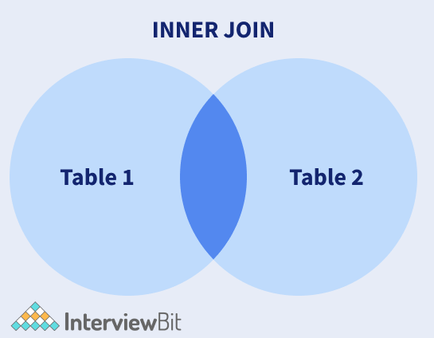

#### example
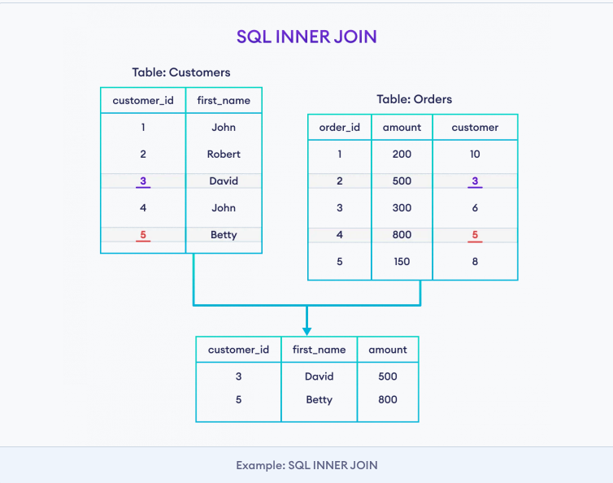

### how inner join works (dàn trận)
-- inner join on product_id
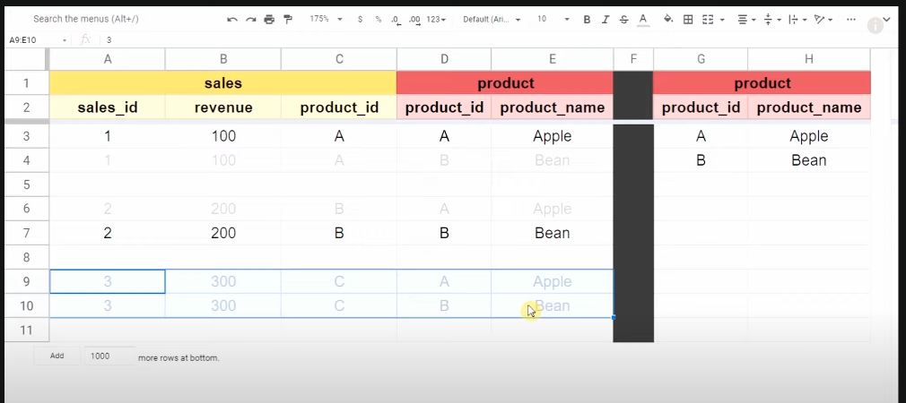

#### syntax
```sql
SELECT columns
FROM table1
INNER JOIN table2
ON table1.column_name = table2.column_name;
```

```sql
-- inner join with where clause
SELECT Customers.customer_id, Customers.first_name, Orders.amount
FROM Customers
INNER JOIN Orders
ON Customers.customer_id = Orders.customer
WHERE Orders.amount >= 500;
```

```sql
-- inner join with alias
SELECT C.cat_name, P.prod_title
FROM Categories AS C
INNER JOIN Products AS P
ON C.cat_id= P.cat_id;
```

### 2. right join
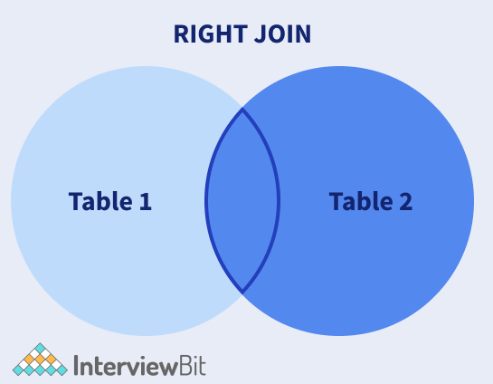

#### example
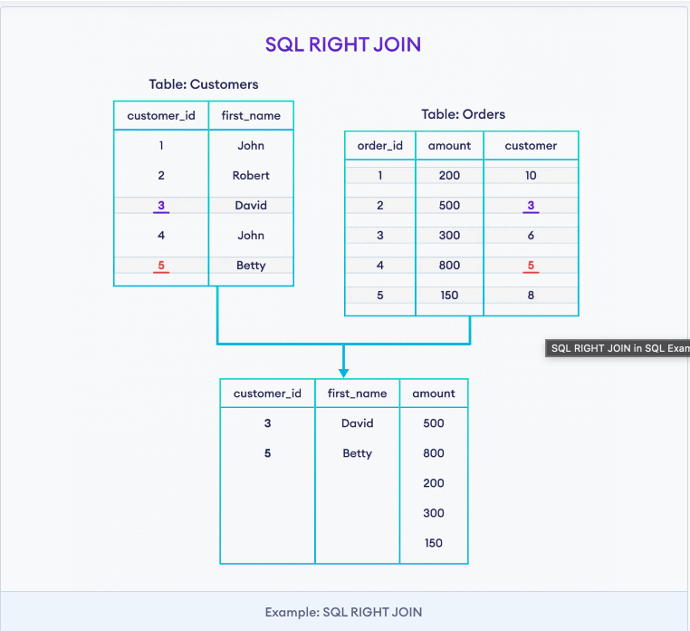


#### syntax
```sql
SELECT columns
FROM table1
RIGHT JOIN table2
ON table1.column_name = table2.column_name;
```

```sql
-- right join with where clause
SELECT Customers.customer_id, Customers.first_name, Orders.amount
FROM Customers
RIGHT JOIN Orders
ON Customers.customer_id = Orders.customer
WHERE Orders.amount >= 500;
```

```sql
-- right join with alias
SELECT C.cat_name, P.prod_title
FROM Category AS C
RIGHT JOIN Products AS P
ON C.cat_id= P.cat_id;
```

### 3. left join
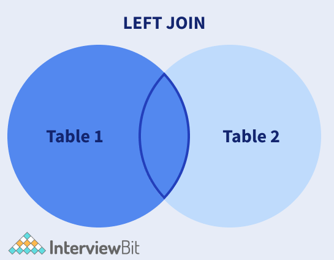

#### example
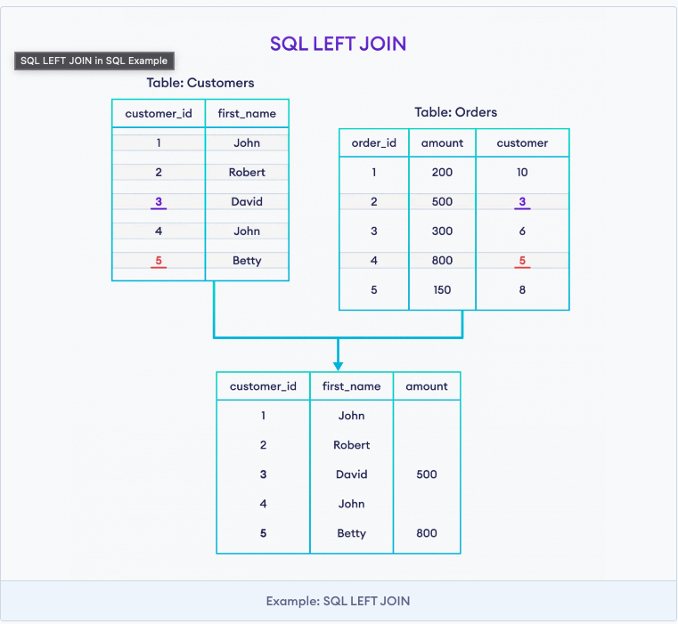

### how left join works
-- left join on product_id
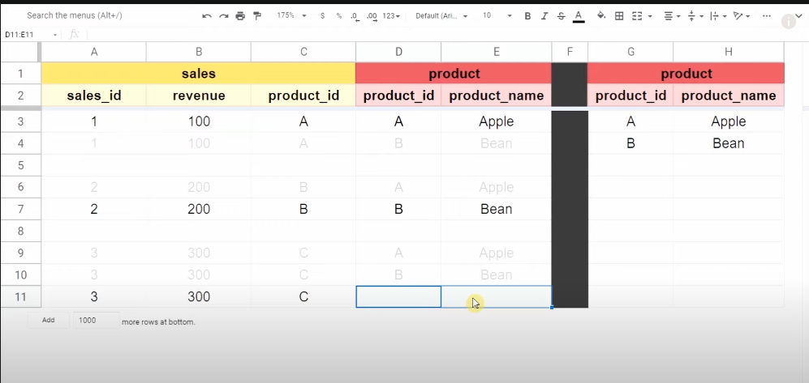
(kiểm tra row nào có ở left table, mà chưa có ở right table thì giữ lại và hiển thị null value có thể do sản phẩm bên right table bị thiếu. Dữ liệu này sẽ được xử lý sau vì nếu không lấy sẽ ảnh hưởng đến giá trị thật của sale)

#### syntax
```sql
SELECT columns
FROM table1
LEFT JOIN table2
ON table1.column_name = table2.column_name;
```

```sql
-- left join with where clause
SELECT Customers.customer_id, Customers.first_name, Orders.amount
FROM Customers
LEFT JOIN Orders
ON Customers.customer_id = Orders.customer
WHERE Orders.amount >= 500;
```

```sql
-- left join with alias
SELECT C.cat_name, P.prod_title
FROM Categories1 AS C
LEFT JOIN Products AS P
ON C.cat_id= P.cat_id;
```

### 4. outer join
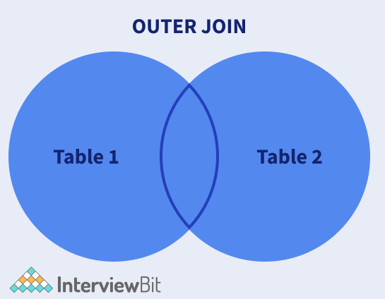

#### example
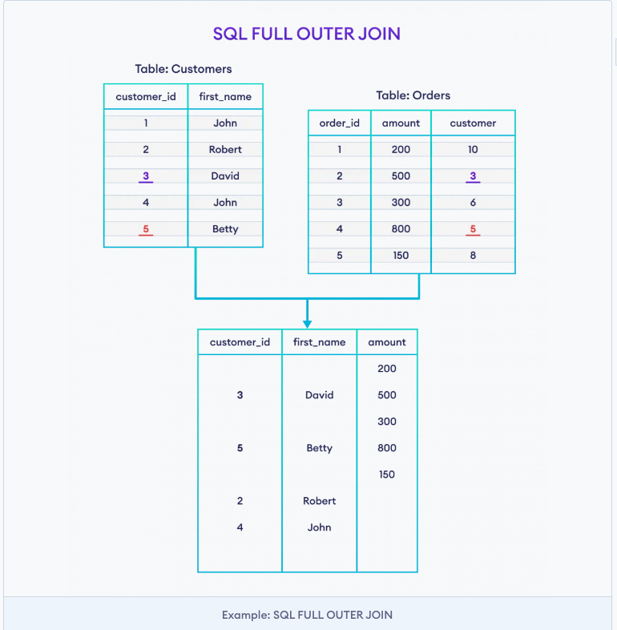

### how outer join works
-- outer join on month and sale columns
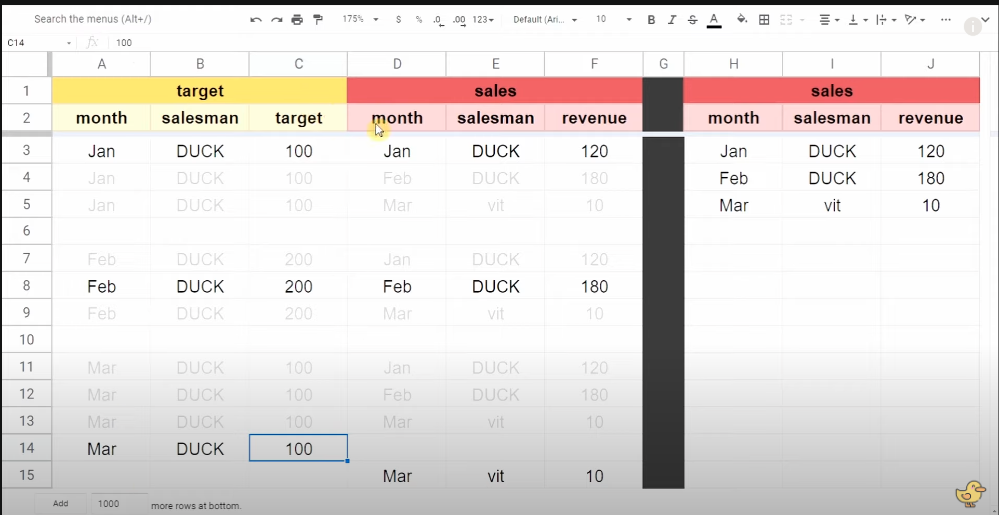
(dùng khi muốn không mất dữ liệu bị thiếu ở cả hai bảng)

#### syntax
```sql
SELECT columns
FROM table1
FULL OUTER JOIN table2
ON table1.column_name = table2.column_name;
```

```sql
-- outer join with where clause
SELECT Customers.customer_id, Customers.first_name, Orders.amount
FROM Customers
FULL OUTER JOIN Orders
ON Customers.customer_id = Orders.customer
WHERE Orders.amount >= 500;
```

```sql
-- outer join with alias
SELECT C.cat_name, P.prod_title
FROM Category AS C
FULL OUTER JOIN Products AS P
ON C.cat_id=
```

[source](https://www.interviewbit.com/sql-cheat-sheet/#joins-in-sql)
[source](https://www.youtube.com/watch?v=KK25c_OyhJE&list=PL01fPqVNMdrlUiW8U0iXZg3r3qbqlPv_7&index=4)

- join là công cụ nối 2 bảng theo chiều ngang
