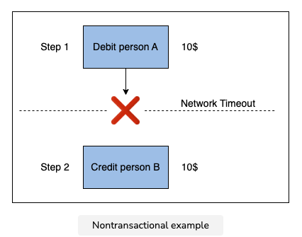
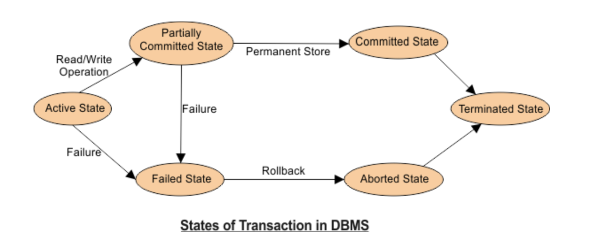

### what is a transaction?
### why is a transaction required?
~~~html
Now, let’s say there was a network timeout after Step 1.
Person A sees a reduced balance, but person B does not see a balance credit, which is undesirable.
This example shows why database transactions are significant in real-world scenarios.
~~~

### transaction states
~~~html
- active
- partially committed
- committed
- failed
- aborted
- terminated
~~~

