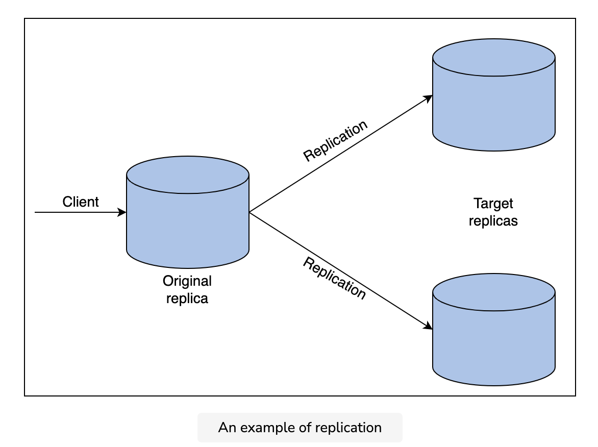

### What Is Replication in Databases?
~~~html
Replication is copying data from a host machine to multiple destination machines connected via a network. Basically, replication is the process of storing data in more than one place. Every node that stores a copy of the data is called a replica.
~~~

##### These are the advantages of replication:
- High availability
- Load distribution
- Reduced latency

### Types of replication
There are a number of different types of replication:

1. Full replication
2. Transactional replication
3. Snapshot replication
4. Merge replication
5. Key-based incremental replication

### Challenges of replication

### Replication log
