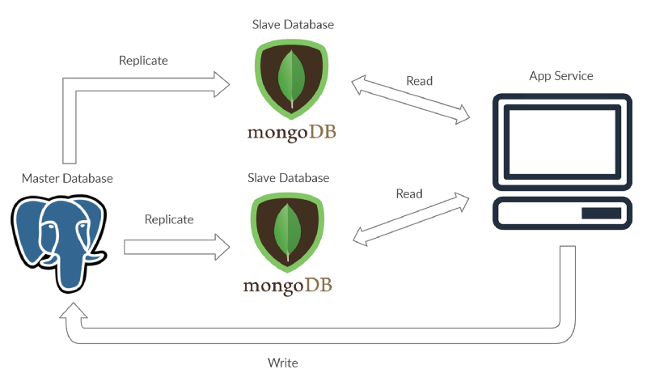

```html

                                 Read
   |-------Replicate-->[Slave]<--------
   |                                  |
   |                                  v
[Master]                            [App Service]
   |                                  ^   |
   |                                  |   |
   |-------Replicate-->[Slave]<-------    |
   |                              Read    |
   |                                      |
    <---------------Write-----------------


[source](https://www.datadriveninvestor.com/2020/05/28/the-master-slave-database-concept-for-beginners/#)
```

### how to implement