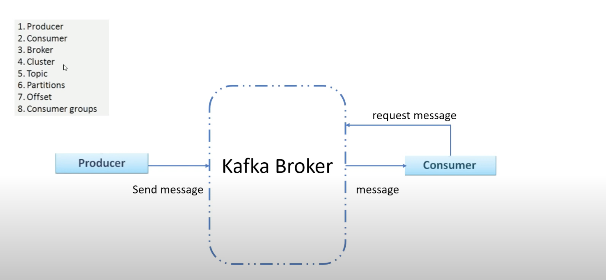
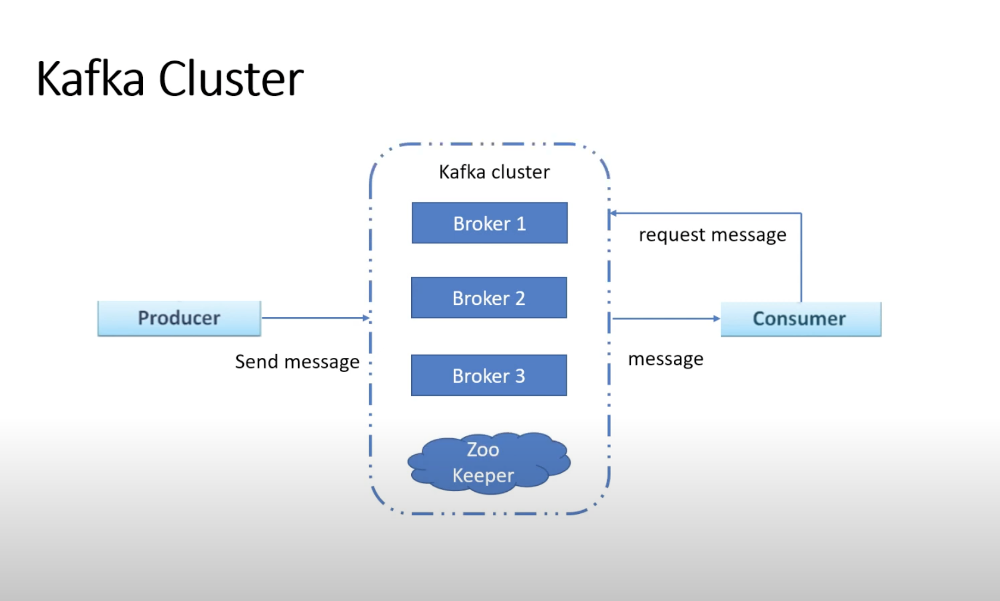

### Kafka components
1. Producer
2. Consumer
3. Broker
4. Cluster
5. Topic
6. Partions
7. Offset
8. Consumer groups

### explaining

- producer same as a youtuber who post their video
- consumer same as a subscriber who watch his video in youtube
- topic is an unique name for kafka stream

