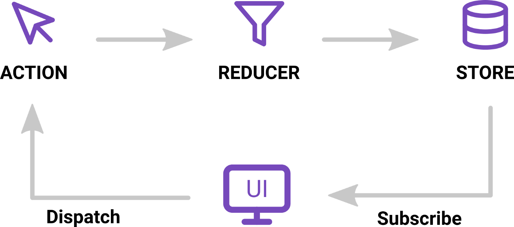

Redux has 3 main parts:
```html
1. Actions
2. Reducers
   +  It takes two parameters: the current state and action
3. Store
   + Redux store methods:
 		- getState for reading the current state of the application
 		- dispatch for dispatching an action
 		- subscribe for listening to state changes
```


### selectors: are getters for the redux state
### action creator:
