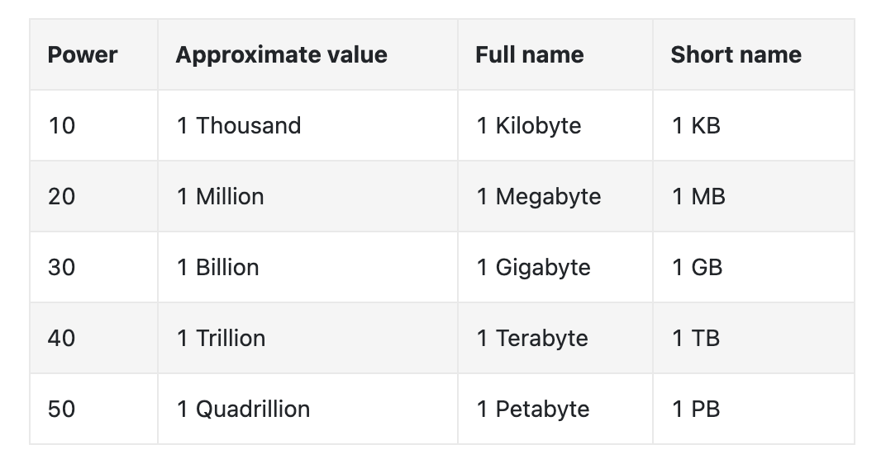
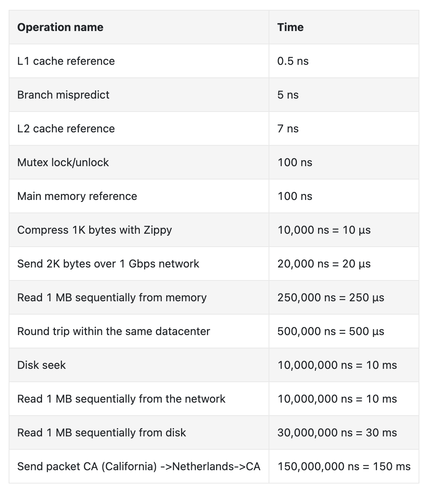
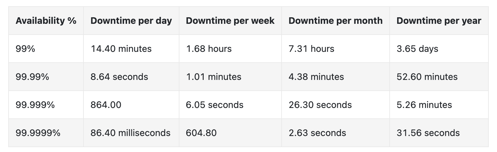

## Power of two

## Latency numbers every programmer should know

##### notes
~~~html
ns = nanosecond, µs = microsecond, ms = millisecond

1 ns = 10^-9 seconds
1 µs= 10^-6 seconds = 1,000 ns
1 ms = 10^-3 seconds = 1,000 µs = 1,000,000 ns
~~~
## Availability numbers
~~~html
High availability is the ability of a system to be continuously
operational for a desirably long period of time. High availability
is measured as a percentage, with 100% means a service
that has 0 downtime. Most services fall between 99% and 100%

A service level agreement (SLA) is a commonly used term
for service providers. This is an agreement between you (the service provider)
and your customer, and this agreement formally defines the level
of uptime your service will deliver. Cloud providers Amazon [4],
Google [5] and Microsoft [6] set their SLAs at 99.9% or above.
Uptime is traditionally measured in nines. The more the nines, the better.
As shown in Table 3, the number of nines correlate to the expected system downtime.
~~~

### example: Estimate Twitter QPS and storage requirements

~~~html
1. Assumptions:
- 300 million monthly active users.
- 50% of users use Twitter daily.
- Users post 2 tweets per day on average.
- 10% of tweets contain media.
- Data is stored for 5 years.

2. Estimations:
2.a. Query per second (QPS) estimate:
- Daily active users (DAU) = 300 million * 50% = 150 million
- Tweets QPS = 150 million * 2 tweets / 24 hour / 3600 seconds = ~3500
- Peek QPS = 2 * QPS = ~7000

2.b We will only estimate media storage here.
- Average tweet size:
- tweet_id 64 bytes
- text 140 bytes
- media 1 MB
- Media storage: 150 million * 2 * 10% * 1 MB = 30 TB per day
- 5-year media storage: 30 TB * 365 * 5 = ~55 PB
~~~
