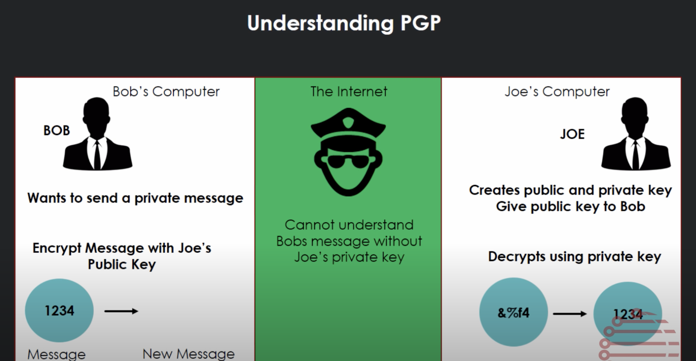

#### PGP: pretty good privacy

- PGP can use a number of encryption algorithms to generate its keys.
One of those is Rivest–Shamir–Adleman (RSA)

[source](https://vi.wikipedia.org/wiki/Pretty_Good_Privacy)
[source](https://www.precisely.com/blog/data-security/pgp-vs-rsa-encryption-difference)

### how it works
[source](https://www.linode.com/docs/guides/gpg-keys-to-send-encrypted-messages/)

### tools
https://pgptool.org/#

### understanding

