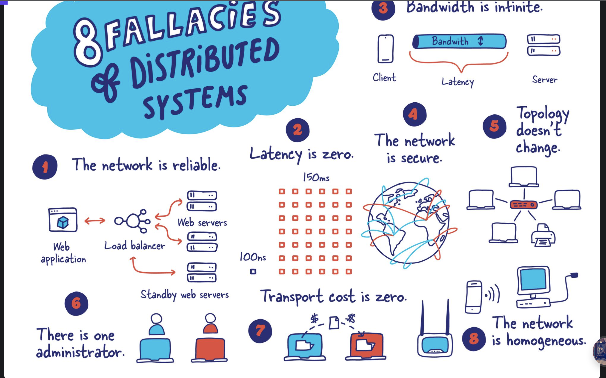

1. the network is reliable
2. latency is zero
3. bandwidth is inifinite
4. the network is secure
5. topology doesn't change
6. there is one administrator
7. transport cost is zero
8. the network is homogeneous

[source](https://architecturenotes.co/fallacies-of-distributed-systems/)
